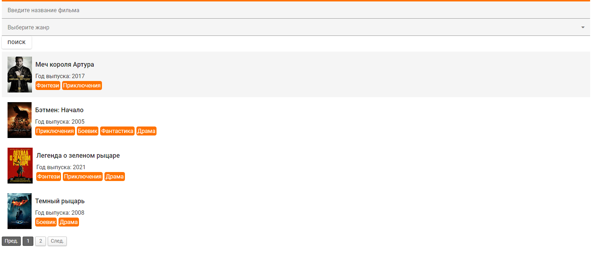
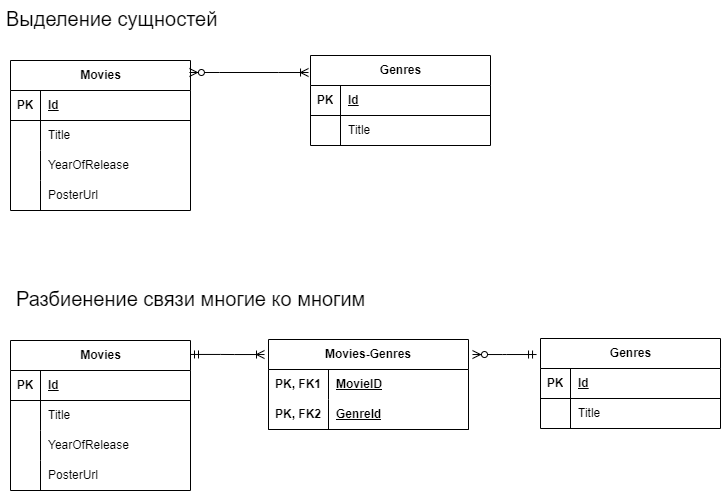

 <a name="thetableofcontents"></a>
- [Цель документа](#цель-документа)
- [Погружение системного аналитика в новый проект](#погружение-системного-аналитика-в-новый-проект)
- [Получение бизнес требований от заказчика](#получение-бизнес-требований-от-заказчика)
- [Получение информации от команды и бизнеса](#получение-информации-от-команды-и-бизнеса)
- [Анализ текущей информационной системы AS IS](#анализ-текущей-информационной-системы-as-is)
- [Функциональные требования](#функциональные-требования)
- [Системные требования к БД](#системные-требования-к-бд)
- [Требования к Backend](#требования-к-backend)
- [Требования к Frontend](#требования-к-frontend)
- [Техническая реализация Backend части](#техническая-реализация-backend-части)
- [Техническая реализация Frontend части](#техническая-реализация-frontend-части)
- [Ветки репозитория](#ветки-репозитория)
- [Примечание](#примечание)

## Цель документа

Документ включает требования, дополнительные материалы и проекты Backend и Frontend, созданные для [вебинара](https://evapps.timepad.ru/event/3003056/)

[Вернуться к содержанию](#thetableofcontents)


## Погружение системного аналитика в новый проект
Часто системному аналитику при погружение в новый проект необходимо разбираться в текущей системе, которая плохо документирована или не документирована вовсе. В рамках вебинара мы рассмотрим с чего можно начать и вариант написания требований. 

[Вернуться к содержанию](#thetableofcontents)

## Получение бизнес требований от заказчика
В рамках вебинара рассмотрим в качестве системы для доработок витрину кинофильмов, в которой уже разработа фильтрация по названию и навигирование по страницам. 

Предполагаем, что нам поступило следующие бизнес требование от заказчика: 

***Внедрить в витрину кинофильмов жанры, реализовать поиск по жанру.*** 

Также мы получили макет от дизайнера на улучшенную витрину фильмов:


[Вернуться к содержанию](#thetableofcontents)

## Получение информации от команды и бизнеса

Команда
1. Что представляет из себя текущая система?
2. Какая БД используется, где получить доступы?
3. Какие endpoints можно использовать? Есть ли swagger?
4. Какой url использовать для работы с текущей системой?
5. Какие тестовые среды есть?

Бизнес
1. Как добавляются жанры и фильмы?   
2. Может ли пользователь выбрать несколько жанров в фильтре?
3. Поиск по точному вхождению или частичному совпадению?
4. Предусмотрено уделание жанров?


[Вернуться к содержанию](#thetableofcontents)

## Анализ текущей информационной системы AS IS

1. Использование DevTools для анализа запросов.
2. Исследование таблиц текщей БД.
3. Запросы к системе с помощью Swagger/Postman.
4. Анализ отличий макетов.

[Вернуться к содержанию](#thetableofcontents)

## Функциональные требования
1. Система позволяет фильтровать фильмы по наименованию фильма и/или жанру.
2. Система позволяет сбрасывать фильтр.
3. Система позволяет переключаться между страницами фильмов.
4. Система позволяет выбрать жанр по его наименованию.

[Вернуться к содержанию](#thetableofcontents)

## Системные требования к БД

Скрипт БД

```sql
create table if not exists movies (
id serial primary key,
title TEXT not null,
posterurl TEXT not null,
yearofrelease integer not null);

create table if not exists genres (
id serial primary key,
title TEXT not null);

create table if not exists movies_genres (
movie_id integer not null,
genre_id integer not null,
primary key(movie_id, genre_id)
);

ALTER TABLE public.movies_genres ADD CONSTRAINT movies_genres_genres_fk FOREIGN KEY (genre_id) REFERENCES public.genres(id);
ALTER TABLE public.movies_genres ADD CONSTRAINT movies_genres_movies_fk FOREIGN KEY (movie_id) REFERENCES public.movies(id);
```
[Вернуться к содержанию](#thetableofcontents)

## Требования к Backend
1. Реализовать endpoint **GET /genres** для получения id и наименования жанра. 
   Вариант ответа: 
```json
{
    "items": [
        {
            "id": 1,
            "title": "Фэнтези"
        },
        {
            "id": 2,
            "title": "Приключения"
        },
        {
            "id": 3,
            "title": "Боевик"
        },
        {
            "id": 4,
            "title": "Фантастика"
        },
        {
            "id": 5,
            "title": "Драма"
        }
    ]
}
```

[Вернуться к содержанию](#thetableofcontents)

2. Добавить параметр запроса genreid в запрос **GET /movies** для фильтрации фильмов в том числе по выбранному жанру.
Пример, запроса **api/movies?pagesize=4&page=1&genreid=1**

**Список всех параметров**
| Параметр      | Опциональный | Значение по-умолчанию|
| -----------   | -----------  | -----------          |
| pagesize      | да           |4                     |
| page          | да           |1                     |
| title         | да           |пустое                |
| genreid       | да           |пустое                |


**Вариант ответа:**
```json
{
    "items": [
        {
            "id": 6,
            "title": "Лабиринт фавна",
            "posterUrl": "https://upload.wikimedia.org/wikipedia/ru/thumb/c/c7/El_laberinto_del_fauno_%28poster%29.jpg/200px-El_laberinto_del_fauno_%28poster%29.jpg",
            "yearOfRelease": 2006,
            "genres": [
                1,
                5
            ]
        },
        {
            "id": 3,
            "title": "Легенда о зеленом рыцаре",
            "posterUrl": "https://upload.wikimedia.org/wikipedia/ru/thumb/0/04/The-Green-Knight.jpg/211px-The-Green-Knight.jpg",
            "yearOfRelease": 2021,
            "genres": [
                1,
                2,
                5
            ]
        },
        {
            "id": 1,
            "title": "Меч короля Артура",
            "posterUrl": "https://upload.wikimedia.org/wikipedia/ru/thumb/c/c6/King_Arthur_Legend_of_the_Sword.jpg/202px-King_Arthur_Legend_of_the_Sword.jpg",
            "yearOfRelease": 2017,
            "genres": [
                1,
                2
            ]
        }
    ],
    "pageSize": 4,
    "page": 1,
    "total": 3
}
```
[Вернуться к содержанию](#thetableofcontents)


## Требования к Frontend
<details><summary>Макет</summary>


</details>

1. После загрузки страницы показываются редкатор ввода фильма, редактор выбора жанра, кнопка Поиск и фильмы для певой страницы (количество фильмов 4 на странице). Для выборки фильмов на первой страницы необходимо выполнить запрос: **/api/movies?pagesize=4&page=1**
2. Редактор ввода фильма по-умолчанию пустой (нет значения), показывает значение placeholder "Введите название фильма".
3. Редактор ввода жанров по-умолчанию пустой (нет значения), показывает значение placeholder "Выберите жанр". Выпадающий список заполяется названиями жанров - вызов метода **GET /api/genres**. При выборе жанра на сервер передается id жанра, не наименование.
4. После нажатия кнопки Поиск посылается запрос на backend c параметрами. Получение параметров:
   
| Параметр      | Назначение              | Получение | Значение по-умолчанию|
| -----------   | ----------------------  | -----------  | -----------          |
| pagesize      | Количество элементов на странице      | в MVP всегда 4         |4                     |
| page          | Номер страниц           | Передается значение страницы пейджера           |1                     |
| title         | Текст поиска в название | Берется из редактора ввода фильма          |пустое                |
| genreid       | Идентификатор жанра     | Берется id жанра из редактора выбора жанра          |пустое                | 

Пример запроса со всеми параметрами: **/api/movies?genreid=1&page=1&title=меч&pagesize=4**

5. **Примеры ответа сервера:**   
   a. **Получение списка жанров**
    Вызов GET /api/genres
    <details><summary>Пример ответа</summary>

        ```js
        {
            "items": [
                {
                    "id": 1,
                    "title": "Фэнтези"
                },
                {
                    "id": 2,
                    "title": "Приключения"
                },
                {
                    "id": 3,
                    "title": "Боевик"
                },
                {
                    "id": 4,
                    "title": "Фантастика"
                },
                {
                    "id": 5,
                    "title": "Драма"
                }
            ]
        }
        ```
        

    </details>  

   b. **Получение списка фильмов**
    Вызов GET /api/movies  
    <details><summary>Пример ответа</summary>

        ```json
        {
            "items": [
                {
                    "id": 3,
                    "title": "Легенда о зеленом рыцаре",
                    "posterUrl": "https://upload.wikimedia.org/wikipedia/ru/thumb/0/04/The-Green-Knight.jpg/211px-The-Green-Knight.jpg",
                    "yearOfRelease": 2021,
                    "genres": [
                        1,
                        2,
                        5
                    ]
                },
                {
                    "id": 4,
                    "title": "Темный рыцарь",
                    "posterUrl": "https:////upload.wikimedia.org/wikipedia/ru/thumb/f/f4/%D0%A2%D1%91%D0%BC%D0%BD%D1%8B%D0%B9_%D1%80%D1%8B%D1%86%D0%B0%D1%80%D1%8C_%282008%29_%D0%BF%D0%BE%D1%81%D1%82%D0%B5%D1%80.jpg/200px-%D0%A2%D1%91%D0%BC%D0%BD%D1%8B%D0%B9_%D1%80%D1%8B%D1%86%D0%B0%D1%80%D1%8C_%282008%29_%D0%BF%D0%BE%D1%81%D1%82%D0%B5%D1%80.jpg",
                    "yearOfRelease": 2008,
                    "genres": [
                        3,
                        5
                    ]
                }
            ],
            "pageSize": 4,
            "page": 1,
            "total": 2
        }
        ```

    </details>
        В ответе ключ total возвращает количество найденных фильмов и может быть использован для корректного отображения количества страниц в пейджере.
[Вернуться к содержанию](#thetableofcontents)

## Техническая реализация Backend части

1. Разработка выполнена на .NET Framework, языке программирования C# в бесплатной среде разработки [Visual Studio Community](https://visualstudio.microsoft.com/vs/community/).
2. В проекте используется локальная БД PostgreSql, запускается локальный сервер PostgreSql. В качестве клиента работаеющего с БД используется DBeaver. 
3. Для связи классов моделей данных на С# и БД используется Nuget пакет [Dapper](https://github.com/DapperLib/Dapper).

[Вернуться к содержанию](#thetableofcontents)

## Техническая реализация Frontend части

1. Разработка выполнена на JavaScript + jQuery с использованеим [DevExtreme](https://js.devexpress.com/) компоненентов в режиме ознакомления.  

## Ветки репозитория
1. **master** - в этой ветке находится оригинальный проект с которого системный аналитик начинает работу.
2. **movies-with-genres** - в этой ветке находится доработанный по требованиям проект.

## Примечание

Любое Frontend решение может быть продемонстрирована с помощью платформы codepen. Например, показ фильмов c фильтрацией на клиенте реализован по ссылке: https://codepen.io/Marina-Makarova-the-builder/pen/zYVQRwW

[Вернуться к содержанию](#thetableofcontents)

